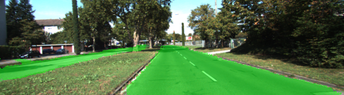
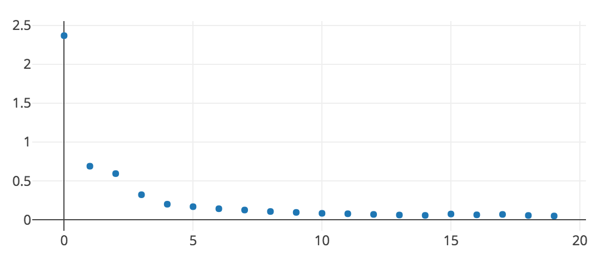

# Semantic Segmentation
## Introduction
In this project, the pixels of a road in images are labeled using a Fully Connected Network (FCN).
Apart from a few adjustments, the implementation in the ' main.py' is very similar to the original Udacity's repository.
The network architecture (using Layer 3,4 and 7 from VGG and having skip connections and upsampling) are copied from examples and recommendations from the Udacity lectures, as well as the 'strides' and 'kernel_size' variables for the convolutional transpose layers.


## Results
Having done some passes with varying values for the parameters, I came to the quite acceptable results observed in the pictures below, given the following values:
```
EPOCHS = 20
BATCH SIZE = 1
LEARNING RATE = 0.0001
DROPOUT = 0.75
```
### Result Images




### Average training losses for each of the 20 epochs


## Shape of layers used
```
------------------
shapes of layers:
------------------
layer3 --> (1, 20, 72, 256)
layer4 --> (1, 10, 36, 512)
layer7 --> (1, 5, 18, 4096)
layer3 conv1x1 --> (1, 20, 72, 2)
layer4 conv1x1 --> (1, 10, 36, 2)
layer7 conv1x1--> (1, 5, 18, 2)
decoderlayer1 transpose: layer7 k = 4 s = 2 --> (1, 10, 36, 2)
decoderlayer2 skip: decoderlayer1 and layer4conv1x1 --> (1, 10, 36, 2)
decoderlayer3 transpose: decoderlayer2 k = 4 s = 2 --> (1, 20, 72, 2)
decoderlayer4 skip: decoderlayer3 and layer3conv1x1 --> (1, 20, 72, 2)
decoderlayer5 transpose: decoderlayer4 k = 16 s = 8 --> (1, 160, 576, 2)
```

### Setup
##### GPU
`main.py` will check to make sure you are using GPU - if you don't have a GPU on your system, you can use AWS or another cloud computing platform.
##### Frameworks and Packages
Make sure you have the following is installed:
 - [Python 3](https://www.python.org/)
 - [TensorFlow](https://www.tensorflow.org/)
 - [NumPy](http://www.numpy.org/)
 - [SciPy](https://www.scipy.org/)
##### Dataset
Download the [Kitti Road dataset](http://www.cvlibs.net/datasets/kitti/eval_road.php) from [here](http://www.cvlibs.net/download.php?file=data_road.zip).  Extract the dataset in the `data` folder.  This will create the folder `data_road` with all the training a test images.

### Start
##### Implement
Implement the code in the `main.py` module indicated by the "TODO" comments.
The comments indicated with "OPTIONAL" tag are not required to complete.
##### Run
Run the following command to run the project:
```
python main.py
```
**Note** If running this in Jupyter Notebook system messages, such as those regarding test status, may appear in the terminal rather than the notebook.

### Submission
1. Ensure you've passed all the unit tests.
2. Ensure you pass all points on [the rubric](https://review.udacity.com/#!/rubrics/989/view).
3. Submit the following in a zip file.
 - `helper.py`
 - `main.py`
 - `project_tests.py`
 - Newest inference images from `runs` folder  (**all images from the most recent run**)
 
 ### Tips
- The link for the frozen `VGG16` model is hardcoded into `helper.py`.  The model can be found [here](https://s3-us-west-1.amazonaws.com/udacity-selfdrivingcar/vgg.zip).
- The model is not vanilla `VGG16`, but a fully convolutional version, which already contains the 1x1 convolutions to replace the fully connected layers. Please see this [post](https://s3-us-west-1.amazonaws.com/udacity-selfdrivingcar/forum_archive/Semantic_Segmentation_advice.pdf) for more information.  A summary of additional points, follow. 
- The original FCN-8s was trained in stages. The authors later uploaded a version that was trained all at once to their GitHub repo.  The version in the GitHub repo has one important difference: The outputs of pooling layers 3 and 4 are scaled before they are fed into the 1x1 convolutions.  As a result, some students have found that the model learns much better with the scaling layers included. The model may not converge substantially faster, but may reach a higher IoU and accuracy. 
- When adding l2-regularization, setting a regularizer in the arguments of the `tf.layers` is not enough. Regularization loss terms must be manually added to your loss function. otherwise regularization is not implemented.
 
### Using GitHub and Creating Effective READMEs
If you are unfamiliar with GitHub , Udacity has a brief [GitHub tutorial](http://blog.udacity.com/2015/06/a-beginners-git-github-tutorial.html) to get you started. Udacity also provides a more detailed free [course on git and GitHub](https://www.udacity.com/course/how-to-use-git-and-github--ud775).

To learn about REAMDE files and Markdown, Udacity provides a free [course on READMEs](https://www.udacity.com/courses/ud777), as well. 

GitHub also provides a [tutorial](https://guides.github.com/features/mastering-markdown/) about creating Markdown files.
